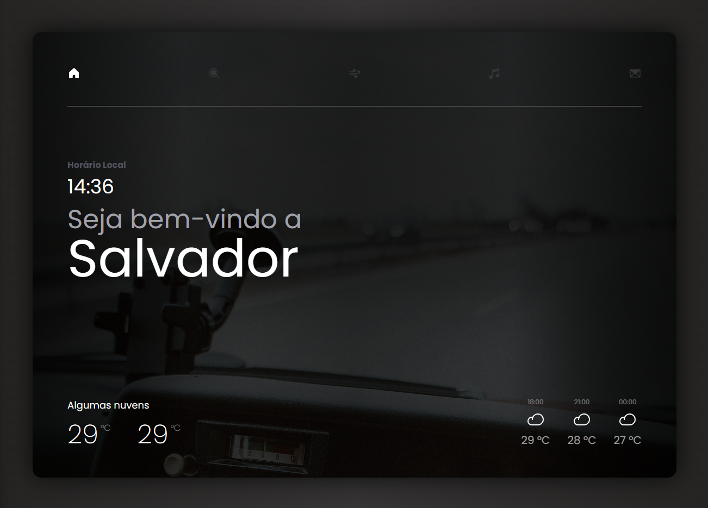
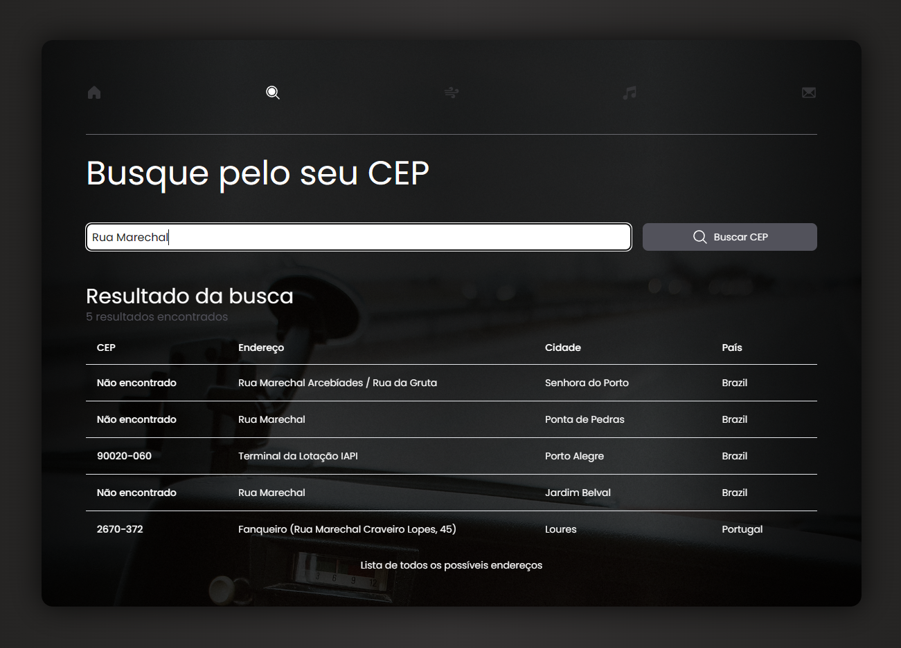
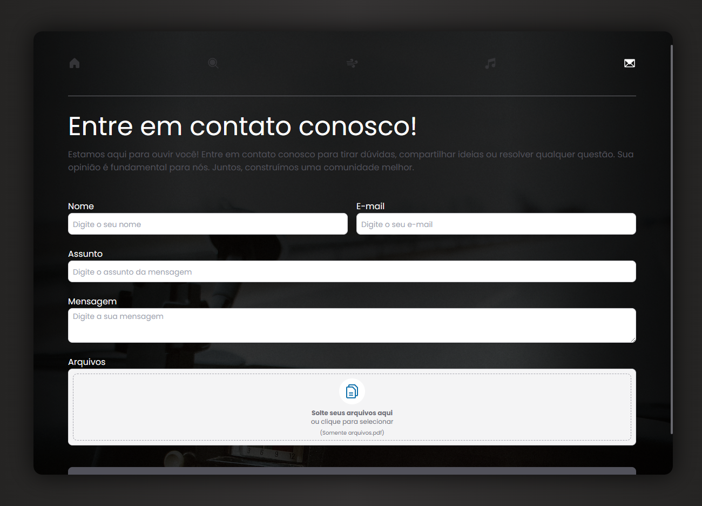

# FIND WEATHER

  

## Um pouco do Projeto:

---

➡ Desafio para avaliar conhecimentos técnicos, como lida com os requisitos e capacidade de pensar em soluções

➡ Você deverá criar uma aplicação utilizando
ReactJS (ou NextJS) contendo as seguintes páginas:

1. Uma página onde o clima seja exibido. Deve-se exibir o
   clima da cidade onde o usuário está
2. Uma página de busca de CEP, onde o usuário deverá inserir
   o nome da rua e a página deverá listar os possíveis resultados
   para tal consulta.
3. Uma página de contato, com um formulário ativo. O submit
   do elemento form, caso você utilize, deverá ser uma função com
   um console.log nos dados do formulário e retorno nulo. Este
   formulário de contato deverá conter também um campo para
   envio de arquivos.

---

## Conteúdos

- [Overview](#overview)
  - [Requisitos](#requisitos)
  - [Como rodar o projeto](#como-rodar-o-projeto)
  - [Como utilizar](#como-utilizar-o-projeto)
  - [Screenshot e Páginas](#screenshot-paginas)
- [Processo](#processo)
  - [Pre Desenvolvimento](#pre-desenvolvimento)
  - [Tecnologia utilizadas](#tecnologias-utilizadas)
  - [Próximos Passos](#proximos-passos)
- [Autor](#autor)

## Overview

### Requisitos

---

A Aplicação deve seguir os seguintes desafios:

- Estilização utilizando o TailwindCSS
- Exibir um design moderno e agradável aos olhos
- A página deverá ser responsiva
- Utilização de elementos flex e grid
- Não sobrecarga de alguma API de terceiro (evitar muitas
  requisições em pouco tempo

### Perguntas a serem respondidas?

- Qual foi a maior dificuldade que você enfrentou ao realizar o teste?

    A maior dificuldade que eu tive dentro do projeto foi fazer o manejo das API's que estão sendo utilizadas para buscar os dados necessários, se tratando de mais de um tipo de API e na página principal é necessário fazer mais de uma requisição para obter todos os dados. E pela utilização do NextJS, transferi essas requisições para o Back-End que o Next proporciona para poder separar mais essas funções e ficar mais organizado.
- Descreva a funcionalidade e o por quê da utilização das bibliotecas 
escolhidas por você para concluir o desafio.

  As funcionalidades da aplicação se tratam de 3:
    
    1. Buscar o clima de acordo com a sua localização
    2. Encontrar o seu CEP de acordo com o seu endereço
    3. Envio de formulário de contato

  As tecnologias utilizadas se tratam do NextJS + TypeScript como a grande carga do projeto e as duas utilizações são pela fato da performance que o NextJS proporciona para a aplicação e o BackEnd que ele proporciona. Não foi possível utilizar o Server Side com mais expressão por conta que as requisições necessitavam de dados do FrontEnd primeiramente, e o TypeScript pelo fato da sua tipagem de dados.

  Utilizei também o Axios para poder fazer essas requisições com maior facilidade e performance. Trouxe o ShadCN para a utilização de seus componentes já prontos e reutilizáveis. O TailwindCSS para criar toda a estilização da aplicação com o css-in-js ao qual traz mais clareza qual estilo está sendo aplicado em cada elemento em tela. E o phosphor react que é a biblioteca de ícones utilizada.

  Trouxe também o Unform + Yup para fazer a validação dos formulários mostrando as mensagem de erros na hora do envio utilizando a forma uncontrolled ao qual não é verificado o conteúdo do input a cada alteração, mas sim quando ele é enviado.
- Como você se vê daqui a 5 anos?

    Daqui a 5 anos eu me vejo sendo um Desenvolvedor Front-End Pleno em busca da Senioridade, dentro de uma empresa em que esteja trabalhando feliz e em um ambiente acolhedor pelos membros. Criando aplicações grandes e impactantes para os seus usuários. Poder estar realizando o sonho de trabalhar sem barreiras físicas, ou seja, de onde eu me sentir mais feliz e a vontade.
- Caso você tenha dado um “Tchammmm!” na sua aplicação, descreva o
que você fez, como isso irá melhorar a experiência do usuário.

### Como rodar o projeto

---

1.  Clone o projeto com `git clone https://github.com/glsvitoria/find-weather`
2.  Após clonar o projeto, basta apenas abrir a pasta do projeto e rodar `npm run dev`

### Como utilizar

---

1.  Autorize a sua localização para poder fazer uma busca do clima na sua cidade e te passar um resumo do clima atual e das próximas horas
2.  Na aba da lupa você pode fazer uma busca para encontrar o seu CEP a partir do seu endereço. Digite sua rua, por exemplo, e a API irá buscar os endereços semelhantes e os possíveis CEP's existentes
3.  Nas abas de vento e música não foram implementados porque não fazia parte do desafios, mas ficou como próximas features
4. Na última aba, a de contato, você pode encaminhar uma mensagem para o suporte passando algum feedback para nós, sendo possível enviar um arquivo em conjunto da mensagem.

### Screenshot e Páginas

---

Home Page - Página do clima

Buscar CEP

Invoice Page - Página de dados da nota fiscal

## Processo

### Principais Tecnologias:

---

### Outras Tecnologias utilizadas:

---

- Estilização e Responsividade: [TailwindCSS](https://tailwindcss.com)
- Criação e validação de formulários: [Unform](https://unform-rocketseat.vercel.app) e [Yup](https://unform-rocketseat.vercel.app/guides/validation)
- Requisições HTTP: [Axios](https://axios-http.com/ptbr/)
- Ícones: [Phosphor-React](https://phosphoricons.com)
- Formatação de Datas: [Date-fns](https://date-fns.org/)

### Próximos passos

---

- Integração da aba de música com o spotify (Em andamento) para poder logar e tocar música
- Implementação aba de vento que irá mostrar mais informações com relação a previsão nos próximos períodos

## Autor

---

- Linkedin - [Guilherme Vitória](https://www.linkedin.com/in/glsvitoria/)
- GitHub - [glsvitoria](https://github.com/glsvitoria)
- Instagram - [glsvitoria](https://www.instagram.com/glsvitoria/)
